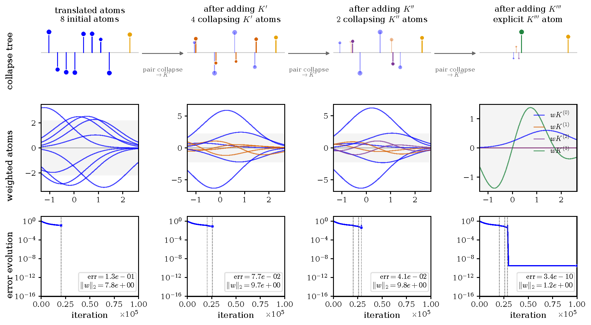
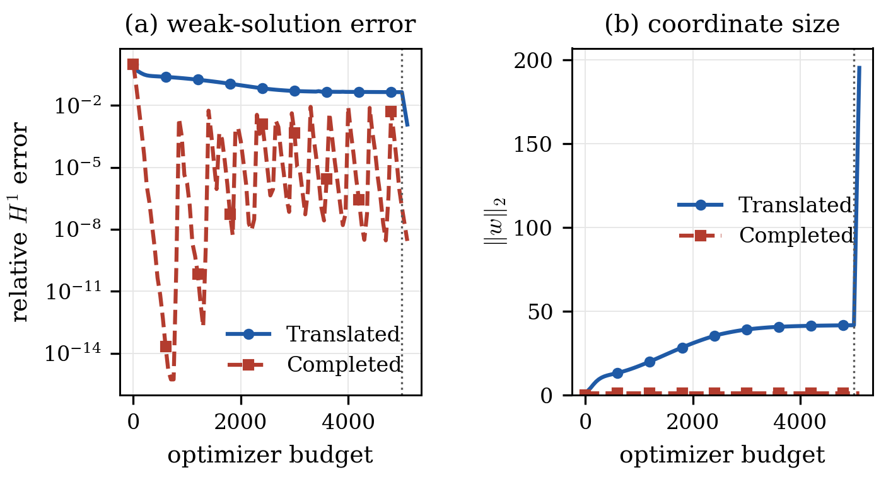

<h1 align="center">Singular Representations in Neural PDE Models</h1>

<p align="center">
  Reproducible experiments for feature collisions, parameter escape,<br>
  finite-precision degradation, and derivative-atom completion.
</p>

<p align="center">
  <a href="https://github.com/danielfdzm/singular-representations-pde/actions/workflows/check.yml"></a>
  
  
</p>

<p align="center">
  <a href="#quick-start">Quick start</a> ·
  <a href="#reproduction-workflows">Reproduce</a> ·
  <a href="#experiment-map">Experiments</a> ·
  <a href="docs/figure-provenance.md">Figure provenance</a> ·
  <a href="#citation">Citation</a>
</p>

Companion artifact for *Stable Solutions and Singular Representations in
Neural PDE Models* by Daniel Fernández and Enrique Zuazua. The repository
contains the experiment sources, checksummed reference histories, and exact
manuscript figures used for the numerical study.

<p align="center">
  <a href="figures/gallery/boundary_completion_third_derivative_representation_lbfgs_plateau.png">
    
  </a>
</p>
<p align="center"><em>
  Successive collisions generate derivative atoms, replacing a singular
  translated representation by completed coordinates.
</em></p>

## What this artifact demonstrates

- **Feature collision and parameter escape.** Represented states can remain
  stable while centers coalesce and compensating coefficients diverge.
- **Conditioning loss at the collision scale.** Gramian degeneration and
  finite-precision degradation appear together in the Gaussian experiment.
- **Completion by derivative atoms.** Confluent coordinates remove the
  singular scale in controlled one- and two-dimensional examples and in a
  matched weak-form elliptic test.

## Selected results

<p align="center">
  <a href="figures/gallery/gaussian_rbf_instability_unpenalized_mixed_precision_diagnostics.png">
    
  </a>
</p>
<p align="center"><em>
  Center collision, Gramian degeneration, and finite-precision degradation
  occur on the same optimization scale.
</em></p>

<p align="center">
  <a href="figures/gallery/matched_elliptic_completion.png">
    
  </a>
</p>
<p align="center"><em>
  Under a matched optimizer budget, completed coordinates attain lower
  weak-solution error while keeping the coordinate norm controlled.
</em></p>

## Quick start

```bash
git clone https://github.com/danielfdzm/singular-representations-pde.git
cd singular-representations-pde

conda env create -f environment.yml
conda activate singular-representations-pde

python reproduce.py --check
python reproduce.py --fast
```

The strict check enforces the recorded NumPy, Matplotlib, and PyTorch versions.
Use `python reproduce.py --check --allow-version-drift` for a structural and
provenance check in another environment. Pip and Linux CPU-only installation
instructions are in [the reproduction guide](docs/reproduction.md).

## Reproduction workflows

| Command | Purpose | Output behavior |
|---|---|---|
| `python reproduce.py --check` | Validate sources, reference data, schemas, versions, and checksums | Read-only |
| `python reproduce.py --fast` | Redraw deterministic and cached figures, then validate | Writes only to ignored `outputs/` |
| `python reproduce.py --matched-controls` | Rerun the one- and two-dimensional matched LBFGS endpoint controls | Writes only to ignored `outputs/matched-controls/` |
| `python reproduce.py --full` | Rerun every optimizer trajectory in the numerical section | Regenerates reference data and audit plots |

The full workflow is intentionally not a routine CI job: it includes two
100-million-step Gaussian trajectories, a one-million-step penalty
continuation, three 100,000-step one-dimensional completion runs, and a
40,000-step two-dimensional run. See
[docs/reproduction.md](docs/reproduction.md) for environment, compiler, seed,
and platform notes.

## Repository layout

```text
.
├── experiments/             standalone experiment and plotting sources
├── data/reference/          checksummed caches grouped by mechanism
├── native/                  C helper for the long mixed-precision trajectory
├── tools/                   artifact validation and reproduction orchestration
├── outputs/                 ignored products of local reproduction runs
├── figures/
│   ├── manuscript/          immutable Fig1.pdf--Fig8.pdf used by the paper
│   ├── gallery/             browser-friendly PNG previews
│   └── supplementary/       additional reported comparison figures
├── docs/                    provenance, reproduction, and limitations
├── reproduce.py             stable repository-level entry point
├── DATA_SHA256SUMS          reference-data checksums
└── FIGURE_SHA256SUMS        manuscript-figure checksums
```

The experiment sources remain flat because several standalone drivers import
neighboring numerical helpers. Data, native code, curated figures, and
generated output are separated by role so runs do not leave artifacts mixed
with source files.

## Experiment map

| Result | Main driver | Reference data | Preview |
|---|---|---|---|
| Tanh offset collision | [`tanh_parameter_escape_loss.py`](experiments/tanh_parameter_escape_loss.py) | [`data/reference/tanh/`](data/reference/tanh/) | [Fig. 1](figures/gallery/wb_trajectories.png) |
| Tanh slope collision | [`tanh_slope_collision_snapshots.py`](experiments/tanh_slope_collision_snapshots.py) | [`data/reference/tanh/`](data/reference/tanh/) | [Fig. 2](figures/gallery/tanh_x_tanhprime_energy_minimization.png) |
| Gaussian center collision | [`gaussian_collision_mixed_precision.py`](experiments/gaussian_collision_mixed_precision.py) | [`data/reference/gaussian/`](data/reference/gaussian/) | [Fig. 3](figures/gallery/gaussian_rbf_instability_unpenalized_mixed_precision_diagnostics.png) |
| Adaptive weight penalty | [`gaussian_instability_adaptive_weight_penalty.py`](experiments/gaussian_instability_adaptive_weight_penalty.py) | [`data/reference/gaussian/`](data/reference/gaussian/) | [Fig. 4](figures/gallery/gaussian_instability_weight_penalty_adaptive_1e-5_to_1e-12.png) |
| One-dimensional completion | [`boundary_completion_experiment.py`](experiments/boundary_completion_experiment.py) | [`data/reference/completion/`](data/reference/completion/) | [Figs. 5–6](figures/gallery/boundary_completion_third_derivative_representation_lbfgs_plateau.png) |
| Directional 2D completion | [`boundary_completion_2d_experiment.py`](experiments/boundary_completion_2d_experiment.py) | [`data/reference/completion/`](data/reference/completion/) | [Fig. 7](figures/gallery/boundary_completion_2d_representation_adam.png) |
| Ingham illustration | [`ingham_illustration.py`](experiments/ingham_illustration.py) | [`data/reference/ingham/`](data/reference/ingham/) | [Fig. 8](figures/gallery/ingham_panel_T_2_5_10_an1_styled.png) |
| Matched weak-form PDE test | [`matched_elliptic_completion.py`](experiments/matched_elliptic_completion.py) | [`data/reference/weak_pde/`](data/reference/weak_pde/) | [Comparison](figures/gallery/matched_elliptic_completion.png) |

Exact commands and the dependency chain for each figure are recorded in
[docs/figure-provenance.md](docs/figure-provenance.md).

## Integrity and provenance

All cached validation and plotting inputs are committed; no external dataset
download is required. Verify the curated records and manuscript PDFs with:

```bash
shasum -a 256 -c DATA_SHA256SUMS
shasum -a 256 -c FIGURE_SHA256SUMS
```

The reference run used Python 3.13.9, NumPy 2.4.2, Matplotlib 3.10.8, and
PyTorch 2.10.0 on CPU. Hardware, threading, and seed details are recorded in
[`execution_environment.json`](execution_environment.json). The exact numbered
publication PDFs are retained once, under `figures/manuscript/`; cached redraws
go to `outputs/` and never overwrite them.

<details>
<summary><strong>Scope and interpretation</strong></summary>

The completion experiments are controlled mechanism studies. Collision
directions, trees, and derivative orders are prescribed in advance. They do
not implement automatic collision discovery, prove generic optimizer
superiority, or establish an optimizer-convergence theorem. The exact
confluent-closure result in the article is one-dimensional; the
two-dimensional experiment is a directional embedding of the same mechanism.
Additional claim boundaries are listed in
[`docs/limitations.md`](docs/limitations.md).

</details>

## Citation

Please cite the associated article and this software artifact.
Machine-readable metadata are provided in [`CITATION.cff`](CITATION.cff). No
article or artifact DOI is claimed here; permanent identifiers can be added
once assigned.

## License status

No open-source license has yet been selected by the authors. The current
[`LICENSE`](LICENSE) records the default copyright status and grants no reuse
license. It should be replaced with an author-approved license before a
permanent archival release intended for reuse.
