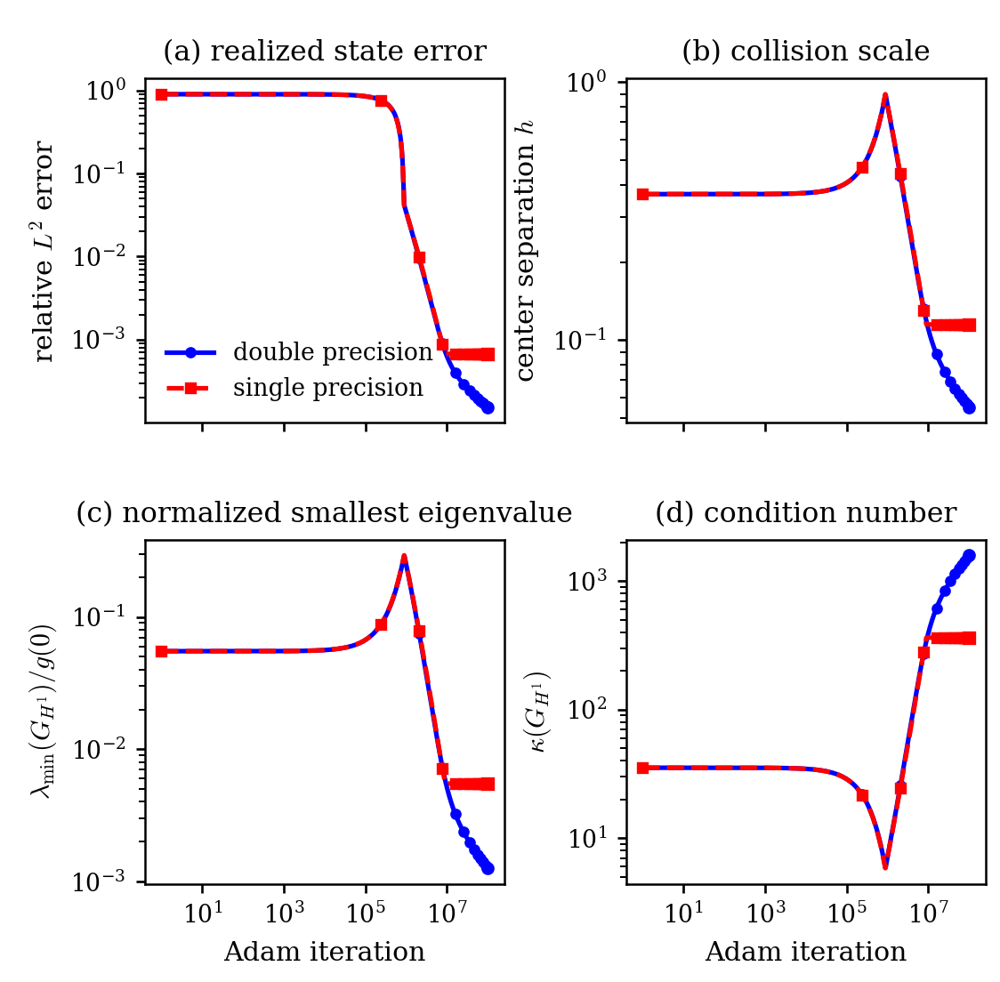

# Stable Solutions and Singular Representations in Neural PDE Models

This repository accompanies the paper by Daniel Fernández and Enrique Zuazua.
It contains the numerical experiments, cached trajectories, and publication
figures used to study a simple but consequential mismatch in neural PDE
models: the represented functions may converge while the parameters used to
represent them become singular.

The central mechanism is **feature collision**. Nearby features become almost
linearly dependent, their coefficients grow with opposite signs, and the
represented state approaches a regular limit that may not belong to the
original fixed-width model.

## Main mathematical picture

- **Collisions are necessary.** In fixed-width translated-feature models,
  separated centers control the feature Gramian and the outer coefficients.
  A strongly convergent sequence can reach a new, unrepresented state only by
  losing center separation.
- **The one-dimensional closure is exact.** Under the assumptions of the
  paper, every strong limit is a finite confluent combination of kernel
  translates and their derivatives, with total multiplicity bounded by the
  original width. Conversely, every such combination can be approximated by
  the original model.
- **The phenomenon is not confined to radial basis functions.** The paper
  constructs an explicit boundary state for a class of fixed-depth tanh
  networks, and shows that unconstrained signed-measure representations can
  have the same loss of compactness.
- **Derivative atoms provide completed coordinates.** Once a collision
  pattern is identified, replacing collapsing translates by kernel
  derivatives preserves the limiting state without retaining the vanishing
  separation scale and diverging coefficients.

## Selected numerical illustrations



*As two Gaussian centers collide, the smallest Gramian eigenvalue decreases,
the condition number grows, and single precision ceases to resolve the same
scale as double precision.*


*Successive collisions are transferred to first-, second-, and
third-derivative atoms. The completed representation reaches the limiting
state with finite coordinates.*


*In the controlled weak-form elliptic test, completed coordinates maintain a
small coordinate norm while attaining a lower error under the matched
optimizer budget.*

## Start here

| If you want to… | Open… |
|---|---|
| See the eight figures exactly as used in the paper | [`figures/paper/`](figures/paper/) |
| Browse the figures in a web browser | [`figures/previews/`](figures/previews/) |
| Reproduce the cached plots | [the reproduction guide](REPRODUCING.md) |
| Find the calculation behind a particular figure | [the experiment guide](experiments/README.md) |
| Inspect the recorded numerical histories | [`data/`](data/) |
| Cite the paper or software | [`CITATION.cff`](CITATION.cff) |

Readers interested only in the mathematics can begin with the summary and
figures above. Running the code is optional; no external dataset is needed.

## Quick reproduction

The shortest route uses Conda and redraws the figures from the cached
numerical records:

```bash
git clone https://github.com/danielfdzm/singular-representations-pde.git
cd singular-representations-pde
conda env create -f environment.yml
conda activate singular-representations-pde
python reproduce.py --fast
```

New plots are written to `outputs/`; the publication PDFs in
`figures/paper/` are not overwritten. For validation, individual experiment
commands, platform information, and the warning about the very long full
rerun, see [REPRODUCING.md](REPRODUCING.md).

## Experiment map

| Paper result | Calculation | Cached record | Preview |
|---|---|---|---|
| Tanh bias collision (Fig. 1) | [`tanh_parameter_escape_loss.py`](experiments/tanh_parameter_escape_loss.py) | [`data/tanh/`](data/tanh/) | [view](figures/previews/wb_trajectories.png) |
| Tanh slope collision (Fig. 2) | [`tanh_slope_collision_snapshots.py`](experiments/tanh_slope_collision_snapshots.py) | [`data/tanh/`](data/tanh/) | [view](figures/previews/tanh_x_tanhprime_energy_minimization.png) |
| Gaussian center collision (Fig. 3) | [`gaussian_collision_mixed_precision.py`](experiments/gaussian_collision_mixed_precision.py) | [`data/gaussian/`](data/gaussian/) | [view](figures/previews/gaussian_rbf_instability_unpenalized_mixed_precision_diagnostics.png) |
| Adaptive weight penalty (Fig. 4) | [`gaussian_instability_adaptive_weight_penalty.py`](experiments/gaussian_instability_adaptive_weight_penalty.py) | [`data/gaussian/`](data/gaussian/) | [view](figures/previews/gaussian_instability_weight_penalty_adaptive_1e-5_to_1e-12.png) |
| One-dimensional completion (Figs. 5–6) | [`boundary_completion_experiment.py`](experiments/boundary_completion_experiment.py) | [`data/completion/`](data/completion/) | [view](figures/previews/boundary_completion_third_derivative_representation_lbfgs_plateau.png) |
| Directional two-dimensional completion (Fig. 7) | [`boundary_completion_2d_experiment.py`](experiments/boundary_completion_2d_experiment.py) | [`data/completion/`](data/completion/) | [view](figures/previews/boundary_completion_2d_representation_adam.png) |
| Ingham illustration (Fig. 8) | [`ingham_illustration.py`](experiments/ingham_illustration.py) | [`data/ingham/`](data/ingham/) | [view](figures/previews/ingham_panel_T_2_5_10_an1_styled.png) |
| Matched weak-form PDE test | [`matched_elliptic_completion.py`](experiments/matched_elliptic_completion.py) | [`data/weak_pde/`](data/weak_pde/) | [view](figures/previews/matched_elliptic_completion.png) |

Exact commands and figure provenance are collected in
[`experiments/README.md`](experiments/README.md).

## Scope

These are controlled mechanism studies, not optimizer benchmarks. The targets
and collision patterns are prescribed, and the calculations use deterministic
grids. The exact confluent-closure theorem is one-dimensional; the
two-dimensional experiment illustrates a prescribed directional collision
rather than a general multivariate closure theorem. The experiments do not
perform automatic collision detection or claim generic optimizer superiority.

## Citation and license

Please cite *Stable Solutions and Singular Representations in Neural PDE
Models* and use [`CITATION.cff`](CITATION.cff) for the accompanying software
metadata. The repository is currently distributed under the terms stated in
[`LICENSE`](LICENSE).
